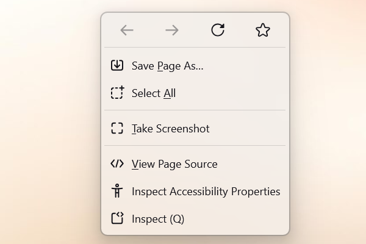

Brings back the now-removed icons to Zen Browser's various context menus, using the browser's built-in icon set.

---

## About This Mod

This mod addresses the removal of icons from Zen Browser's context menus. For users who prefer visual cues for quicker navigation and identification, this mod restores these icons. It leverages the browser's native icon resources, ensuring a consistent look and feel.

## 🙏 Acknowledgements
This mod is heavily inspired by and based on the clever approach and original code snippet shared by **[wolf-yuan-6115](https://github.com/wolf-yuan-6115)** in the Zen Browser discussion thread: **[#8712 "Bring back context menu icons"](https://github.com/zen-browser/desktop/discussions/8712)**.
Full credit to them for the core idea!
